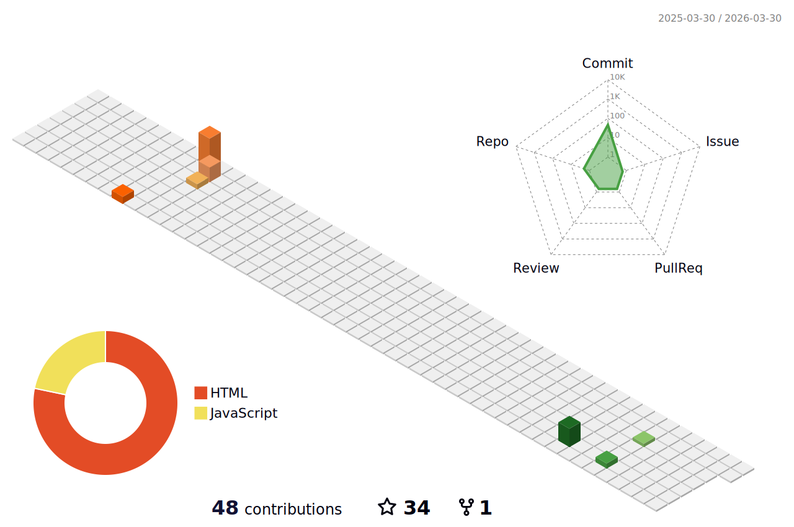

<!-- START_SECTION:waka -->
<!-- END_SECTION:waka -->

<h3 align="center">Olá! Sou,</h3>

  

<!--

  

<h4 align="center">
  Em Transição de Carreira </h4>
-->

 

<table width="1800" align="center">
<tr>
<td valign="top" width="50%">

Moon Today

  <!-- real time -->

</td>

<td valign="top" width="50%">

</td>
</tr>
</table>

</body>

<h2>Linguagens e Ferramentas</h2> 

   
   
  
  
  
   
   

<h1>Projetos</h1> 

 
<table width="1800" align="center">
<tr>
<td valign="top" width="50%">
 
</td>

<td valign="top" width="50%">
  
</td>
</tr>
</table>

  

<h1 align="center">Formações</h1> 

 

| Curso | Instituição | Status | Fim |
|-------|-------------|-----------|----|
|🌀 Game Design | EBAC | Andamento | - |
|🌀 Desenvolvimento Front-End utilizando HTML, CSS, JavaScript, React | DevQuest | Andamento | - |
|☄️ Start GameDev | CrieSeusJogos.com.br | Andamento | - |
|🌀 Engenharia Química - 2º Semestre | UFBA | Andamento | - |
|🌟 Bootcamp Desenvolvimento de Jogos | DIO | Concluído | Dez/2023 |
|🌟 Desenvolvimento Front-End utilizando HTML, CSS, JavaScript | WOMAKERSCODE | Concluído | Nov/2023 |
|🌟 Programação Web - HTML, CSS, JavaScript, Banco de Dados MySQL e PHP | Prefeitura de BH | Concluído | Jan/2023 |
|🌟 Criação de Sites | Prefeitura de BH | Concluído | Dez/2022 |
|🌟 Técnico em Qualidade | IFSULDEMINAS | Concluído | Dez/2021 |
|🌟 Técnico em Química | SENAI Lauro de Freitas (BA) | Concluído | Dez/2019 |
|❄️ Licenciatura em Química - 7° Semestre | Estácio | Trancada | - |

  

  <h1>Status GitHub</h1>
  
  
  
  

  

 

  
   <!-- Site de Origem: https://github.com/yoshi389111/github-profile-3d-contrib -->

  

   

 

<video src="./src/video/FlaviaColiv-2023.stl"></video>
  

  

## Obrigada por visitar meu perfil!

 
 

